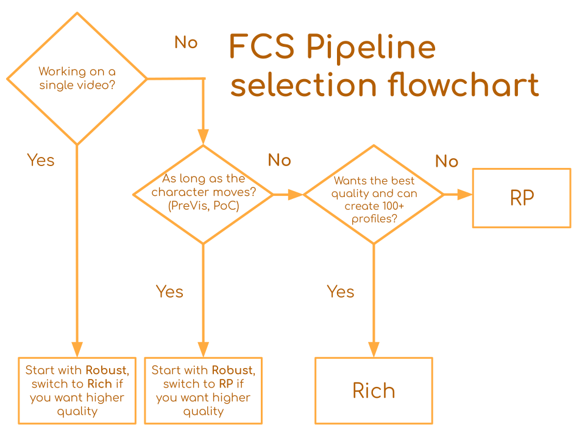

# Pipeline Comparison
FCS comes packaged with multiple algorithms (**pipelines**) for processing footages. 

Each of the pipelines are designed with different usage scenarios in mind. Here is a flowchat to help you determine which you should use. 

### Just tell me which pipeline I should use.

<!-- https://docs.google.com/presentation/d/1G5nimISmlF6UtnMI47KA63R9ldipeWlUf_yNKQ12EC4/edit?usp=sharing -->

### Background
For those who want more information about the pipelines:
We currently offer three pipelines, _Rich_, _Robust_ and _RP_. _Rich_ is the default pipeline up until FCS 25.04, and in the upcoming 25.07 the default will become RP. 

1. Rich

    This pipeline tends to be able to reproduce subtle movement in the character better when provided with large amount of profile (>100) and is generally your best pick for your effort if you work on a large scale projects (full length movies, game) and requires high quality animation. 

3. RP

    The RP pipeline functions as a less-effort-intensive alternative of Rich, by making it more robust to camera shift. 

2. Robust
    
    This is more adoptive to head rotation but less accurate. It is designed to work better when the number of profiles is small (<20). It can be used with either a head-mounted or fixed camera. Additionally, quality degradation is small even when actors changes.

In Zukun we interally use _Rich_ for the majority of our client works. 

By choosing the pipeline that best suits your situation, you can more easily achieve your goals of reducing your workload and improving quality.

<!-- If our tracking is not working as well as it does, even though a large number of profiles are retargeted, changing the processing pipeline may improve the tracking results. This measure is effective for videos captured in a different environment than the profiles, and for videos of the long period capture that HMC is repeatedly attached and detached. \
(Still the most effective way to improve the animation quality of a particular video is to add more profiles from within the video itself.) -->

### Scenario Detail
We show the results of processing by different pipelines on 4 scenarios.

1. Only ROM 50 \
    Process videos using only the 50 ROM profiles picked up from ROM video. 
2. ROM 50 + Video Profile 10 \
    Process videos using the 50 ROM profiles and the 10 profiles picked up from within the video.
3. Only Video Profile 10 \
    Process videos using only the 10 profiles picked up from within the video.
4. Another Actor \
    Process videos of another actor using only the 50 ROM profiles.

If you add a number of profiles from within the video, "Rich" will produce ideal animation results. \
However, when there are not enough profiles from within the video, "Rich" tends to produce less-than-ideal animation results. In this case, "Robust" and "RP" will produce better results. \
When there are a small number of profiles, "Robust" is the best option. As the number of profiles increases, "Rich" and "RP"" become more effective. "Rich" is preferable when there are a number sufficient of profiles, although "RP" is often superior when there are positional changes between the camera and actors.\
Also, when processing the videos of another actor, you can make the animation result less likely to break down by selecting "Robust".

### Gallery

  
Only ROM 50

  | Performance Video | Rich | Robust | RP |
| --------- | --------- | --------- | --------- |
| <video height="300" controls><source src="https://github.com/ZukunFCS/artifacts/raw/refs/heads/master/benchmarks/common/pipeline_comparison_set/down_normal_t01.mp4" type="video/mp4"></video> |<video height="300" controls><source src="https://github.com/ZukunFCS/artifacts/raw/refs/heads/master/benchmarks/pipeline_comparison/baseline/Rich/down_normal_t01.mp4" type="video/mp4"></video> |<video height="300" controls><source src="https://github.com/ZukunFCS/artifacts/raw/refs/heads/master/benchmarks/pipeline_comparison/baseline/Robust/down_normal_t01.mp4" type="video/mp4"></video> |<video height="300" controls><source src="https://github.com/ZukunFCS/artifacts/raw/refs/heads/master/benchmarks/pipeline_comparison/baseline/RP/down_normal_t01.mp4" type="video/mp4"></video> | 
| <video height="300" controls><source src="https://github.com/ZukunFCS/artifacts/raw/refs/heads/master/benchmarks/common/pipeline_comparison_set/Video_45_t01.mp4" type="video/mp4"></video> |<video height="300" controls><source src="https://github.com/ZukunFCS/artifacts/raw/refs/heads/master/benchmarks/pipeline_comparison/baseline/Rich/Video_45_t01.mp4" type="video/mp4"></video> |<video height="300" controls><source src="https://github.com/ZukunFCS/artifacts/raw/refs/heads/master/benchmarks/pipeline_comparison/baseline/Robust/Video_45_t01.mp4" type="video/mp4"></video> |<video height="300" controls><source src="https://github.com/ZukunFCS/artifacts/raw/refs/heads/master/benchmarks/pipeline_comparison/baseline/RP/Video_45_t01.mp4" type="video/mp4"></video> |
| <video height="300" controls><source src="https://github.com/ZukunFCS/artifacts/raw/refs/heads/master/benchmarks/common/pipeline_comparison_set/Video_facepaint_normal_t01.mp4" type="video/mp4"></video> |<video height="300" controls><source src="https://github.com/ZukunFCS/artifacts/raw/refs/heads/master/benchmarks/pipeline_comparison/baseline/Rich/Video_facepaint_normal_t01.mp4" type="video/mp4"></video> |<video height="300" controls><source src="https://github.com/ZukunFCS/artifacts/raw/refs/heads/master/benchmarks/pipeline_comparison/baseline/Robust/Video_facepaint_normal_t01.mp4" type="video/mp4"></video> |<video height="300" controls><source src="https://github.com/ZukunFCS/artifacts/raw/refs/heads/master/benchmarks/pipeline_comparison/baseline/RP/Video_facepaint_normal_t01.mp4" type="video/mp4"></video> |

  
ROM 50 + Video Profile 10

  | Performance Video | Rich | Robust | RP |
| --------- | --------- | --------- | --------- |
| <video height="300" controls><source src="https://github.com/ZukunFCS/artifacts/raw/refs/heads/master/benchmarks/common/pipeline_comparison_set/down_normal_t01.mp4" type="video/mp4"></video> |<video height="300" controls><source src="https://github.com/ZukunFCS/artifacts/raw/refs/heads/master/benchmarks/pipeline_comparison/p_10/Rich/down_normal_t01.mp4" type="video/mp4"></video> |<video height="300" controls><source src="https://github.com/ZukunFCS/artifacts/raw/refs/heads/master/benchmarks/pipeline_comparison/p_10/Robust/down_normal_t01.mp4" type="video/mp4"></video> |<video height="300" controls><source src="https://github.com/ZukunFCS/artifacts/raw/refs/heads/master/benchmarks/pipeline_comparison/p_10/RP/down_normal_t01.mp4" type="video/mp4"></video> |
| <video height="300" controls><source src="https://github.com/ZukunFCS/artifacts/raw/refs/heads/master/benchmarks/common/pipeline_comparison_set/Video_45_t01.mp4" type="video/mp4"></video> |<video height="300" controls><source src="https://github.com/ZukunFCS/artifacts/raw/refs/heads/master/benchmarks/pipeline_comparison/p_10/Rich/Video_45_t01.mp4" type="video/mp4"></video> |<video height="300" controls><source src="https://github.com/ZukunFCS/artifacts/raw/refs/heads/master/benchmarks/pipeline_comparison/p_10/Robust/Video_45_t01.mp4" type="video/mp4"></video> |<video height="300" controls><source src="https://github.com/ZukunFCS/artifacts/raw/refs/heads/master/benchmarks/pipeline_comparison/p_10/RP/Video_45_t01.mp4" type="video/mp4"></video> |
| <video height="300" controls><source src="https://github.com/ZukunFCS/artifacts/raw/refs/heads/master/benchmarks/common/pipeline_comparison_set/Video_facepaint_normal_t01.mp4" type="video/mp4"></video> |<video height="300" controls><source src="https://github.com/ZukunFCS/artifacts/raw/refs/heads/master/benchmarks/pipeline_comparison/p_10/Rich/Video_facepaint_normal_t01.mp4" type="video/mp4"></video> |<video height="300" controls><source src="https://github.com/ZukunFCS/artifacts/raw/refs/heads/master/benchmarks/pipeline_comparison/p_10/Robust/Video_facepaint_normal_t01.mp4" type="video/mp4"></video> |<video height="300" controls><source src="https://github.com/ZukunFCS/artifacts/raw/refs/heads/master/benchmarks/pipeline_comparison/p_10/RP/Video_facepaint_normal_t01.mp4" type="video/mp4"></video> |

  
Only Video Profile 10

  | Performace Video | Rich | Robust | RP |
| --------- | --------- | --------- | --------- |
| <video height="300" controls><source src="https://github.com/ZukunFCS/artifacts/raw/refs/heads/master/benchmarks/common/pipeline_comparison_set/down_normal_t01.mp4" type="video/mp4"></video> |<video height="300" controls><source src="https://github.com/ZukunFCS/artifacts/raw/refs/heads/master/benchmarks/pipeline_comparison/v_10/Rich/down_normal_t01.mp4" type="video/mp4"></video> |<video height="300" controls><source src="https://github.com/ZukunFCS/artifacts/raw/refs/heads/master/benchmarks/pipeline_comparison/v_10/Robust/down_normal_t01.mp4" type="video/mp4"></video> |<video height="300" controls><source src="https://github.com/ZukunFCS/artifacts/raw/refs/heads/master/benchmarks/pipeline_comparison/v_10/RP/down_normal_t01.mp4" type="video/mp4"></video> |
| <video height="300" controls><source src="https://github.com/ZukunFCS/artifacts/raw/refs/heads/master/benchmarks/common/pipeline_comparison_set/Video_45_t01.mp4" type="video/mp4"></video> |<video height="300" controls><source src="https://github.com/ZukunFCS/artifacts/raw/refs/heads/master/benchmarks/pipeline_comparison/v_10/Rich/Video_45_t01.mp4" type="video/mp4"></video> |<video height="300" controls><source src="https://github.com/ZukunFCS/artifacts/raw/refs/heads/master/benchmarks/pipeline_comparison/v_10/Robust/Video_45_t01.mp4" type="video/mp4"></video> |<video height="300" controls><source src="https://github.com/ZukunFCS/artifacts/raw/refs/heads/master/benchmarks/pipeline_comparison/v_10/RP/Video_45_t01.mp4" type="video/mp4"></video> |
| <video height="300" controls><source src="https://github.com/ZukunFCS/artifacts/raw/refs/heads/master/benchmarks/common/pipeline_comparison_set/Video_facepaint_normal_t01.mp4" type="video/mp4"></video> |<video height="300" controls><source src="https://github.com/ZukunFCS/artifacts/raw/refs/heads/master/benchmarks/pipeline_comparison/v_10/Rich/Video_facepaint_normal_t01.mp4" type="video/mp4"></video> |<video height="300" controls><source src="https://github.com/ZukunFCS/artifacts/raw/refs/heads/master/benchmarks/pipeline_comparison/v_10/Robust/Video_facepaint_normal_t01.mp4" type="video/mp4"></video> |<video height="300" controls><source src="https://github.com/ZukunFCS/artifacts/raw/refs/heads/master/benchmarks/pipeline_comparison/v_10/RP/Video_facepaint_normal_t01.mp4" type="video/mp4"></video> |

  
Another Actor

  | Performance Video | Rich | Robust | RP |
| --------- | --------- | --------- | --------- |
| <video height="300" controls><source src="https://github.com/ZukunFCS/artifacts/raw/refs/heads/master/benchmarks/common/other_actor_set/01_joy_sample.mp4" type="video/mp4"></video> |<video height="300" controls><source src="https://github.com/ZukunFCS/artifacts/raw/refs/heads/master/benchmarks/pipeline_comparison/other_actor/Rich/01_joy_sample.mp4" type="video/mp4"></video> |<video height="300" controls><source src="https://github.com/ZukunFCS/artifacts/raw/refs/heads/master/benchmarks/pipeline_comparison/other_actor/Robust/01_joy_sample.mp4" type="video/mp4"></video> |<video height="300" controls><source src="https://github.com/ZukunFCS/artifacts/raw/refs/heads/master/benchmarks/pipeline_comparison/other_actor/RP/01_joy_sample.mp4" type="video/mp4"></video> |        
| <video height="300" controls><source src="https://github.com/ZukunFCS/artifacts/raw/refs/heads/master/benchmarks/common/other_actor_set/02_sadness_sample.mp4" type="video/mp4"></video> |<video height="300" controls><source src="https://github.com/ZukunFCS/artifacts/raw/refs/heads/master/benchmarks/pipeline_comparison/other_actor/Rich/02_sadness_sample.mp4" type="video/mp4"></video> |<video height="300" controls><source src="https://github.com/ZukunFCS/artifacts/raw/refs/heads/master/benchmarks/pipeline_comparison/other_actor/Robust/02_sadness_sample.mp4" type="video/mp4"></video> |<video height="300" controls><source src="https://github.com/ZukunFCS/artifacts/raw/refs/heads/master/benchmarks/pipeline_comparison/other_actor/RP/02_sadness_sample.mp4" type="video/mp4"></video> |

