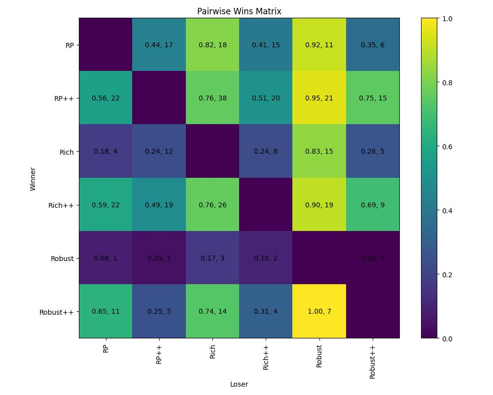
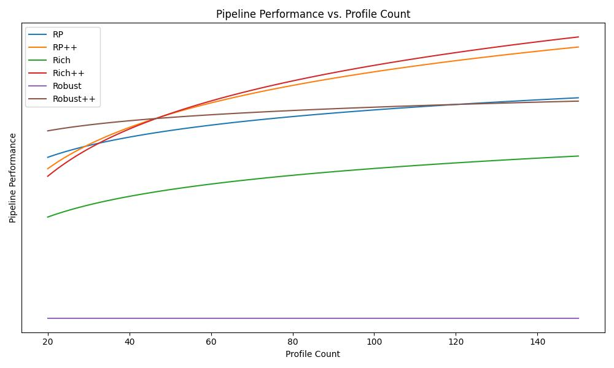

# Pipeline Comparison++ (Quantitative)
### TL;DR
Across 1000 blinded animator comparisons, RP++, Rich++, and Robust++ show consistent preference gains over legacy pipelines, particularly when ≥20 calibration profiles are available. Improvements scale with additional actor-specific data, indicating better identity adaptation rather than baseline tracking changes.

## Background

In 25.10 we released a couple new pipelines (the ones with `++' suffix). For those who are interested, we switched to a new facial tracking backend, which provides much stabler and accurate results compared to our previous backend, especially on close-up images (e.g. from a head-mounted camera). We ironed out some bugs in the pipeline in 26.04, and properly tested whether and how the new tracking pipeline outperform the old ones, and we would love to share it with you if you were interested.

In this page we refer to retarget profiles as individual image of the actor and the corresponding character, rigged to express the same facial expression as the actor in the image.

The quality of animation is a complex concept, first and foremost, it is highly subjective; but generally speaking, a few main factors impact the quality of final animation, including:
1. the quality of the facial tracking (how accurately the facial tracking captures the actor's facial expression), 
2. the quality of the retarget profiles (how well your profile actually matches the actor),
3. the quantity of facial retarget profiles (how many profiles are used to retarget the animation),
4. the quality of the extrapolation method (how well can the algorithm uses your retarget profiles to explain the facial movement of the actor). 

This update focuses on the quality of the facial tracking.
While there are well-established, deterministic metrics that we used internally to evaluate the quality of the facial tracking, we found that they do not necessarily provide a good and reliable indication of the quality of the final animation oftentimes.
As such, we often resort to subjective evaluation by professional animators, and today we would like to share the results of our evaluation with you.

## Methodology
The subjective evaluation is done by a set of in-house professional animators (Raters).

Raters are shown a pair of animations, generated by different pipelines, together with the original performance video. Raters are asked to pick the animation that more faithfully recreates the actor's facial expression in a short clip. Raters were not told which pipeline generated each animation. Presentation order (left/right) was randomized. The total data size is 1000 comparisons, and we have 5 professional raters.

**Clip selection.** 5-second clips were chosen randomly from an internal corpus representative of production data, captured using head-mounted cameras.

**Rater instructions.** Pick the animation that more faithfully recreates the actor's facial expression; the original performance video is shown as reference.

**Replay.** Raters may replay clips as many times as they wish.

**Presentation.** Clips are shown side-by-side, with the reference performance video displayed in the center or flanking both sides (rater's choice).

**Pipeline selection.** Pipeline are randomly selected from the following list: RP, Rich, Robust, RP++, Rich++, Robust++, however, Robust is not widely used in production, so it receives fewer comparisons.

**Profile selection.**  We assume >20 profiles from a Range of Motion (ROM) set, between 0 to 100 profiles from other videos (accumulated from earlier stage of production), and between 0 to 5 profiles from the video that is being processed. This closely mimics different production stages  where earlier only a small number of profiles are available, and later more profiles are available.

Each comparison is evaluated by a single rater. In a smaller-scale pilot study with overlapping assignments, inter-rater agreement was high.

This study focuses primarily on legacy pipelines and their new++ counterparts. 
In addition, we also look into which pipeline performs best when more profiles are available.

Legacy Robust receives fewer comparisons as it is not widely used in production.

## Results

### Win Matrix

We show the raw results of comparison between each of the pipelines. Overall, it is easy to see that our new pipelines, RP++, Rich++ and Robust++ tends to outperform their legacy counterpart.

Note that this matrix aggregates results across all profile counts. The Bradley-Terry model below disentangles the effect of profile count on pipeline performance.

### Bradley-Terry Model

Additionally, we model the performance of the pipelines against each other via the [Bradley–Terry model](https://en.wikipedia.org/wiki/Bradley%E2%80%93Terry_model).

The performance of the pipeline is modeled as follow:

$$
logit(P(pipe_a > pipe_b | s)) = (\beta_a - \beta_b) + (\phi+ (\delta_a - \delta_b)) log(1+s)
$$

where $P(pipe_a > pipe_b)$ represents the probability of pipeline a being selected when being presented with pipeline b, $\beta$ is the base performance of the pipeline, $s$ is the number of profiles, $\phi$ is the shared, global dependence on $s$, and $\delta$ is the marginal effect of additional data to the performance of the pipeline.

| Term | Meaning |
| --- | --- |
| β | intrinsic solver quality with minimal data |
| δ | how efficiently solver converts additional data into quality |
| φ | global diminishing-returns effect |

### Performance vs. Profile Count

After solving for $\beta, \delta, \text{and } \phi$, we can visualize the performance of each of the algorithm at different profile count.

The y-axis represents estimated Bradley-Terry strength, where legacy Robust is anchored at 0 as the baseline. Higher values indicate stronger rater preference. The value corresponds to $\beta + \delta \cdot \log(1+s)$ from the model.

From the graph, the performance of all the new pipelines are on par with our previous reference pipeline RP. The performance gap enlarges between the legacy pipeline and the new pipeline when more profiles are added to the session.

Legacy Robust serves as the reference baseline in the Bradley-Terry model (its strength is fixed at 0). It was designed for multi-actor sessions — a use case that violates the single-actor assumption shared by the other pipelines — which explains its low relative performance in this single-actor evaluation. See [Pipeline Comparison](002_pipeline_comparison.md) for details on when Robust is appropriate.

## Conclusion

Across 1000 blinded animator comparisons, the new pipeline generation (RP++, Rich++, Robust++) shows consistent preference gains over legacy pipelines, with improvements scaling as more calibration profiles are available.
